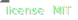
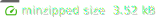

<div align="center">

[](https://localazy.com)

### 📦 `@localazy/cdn-client`

[**Documentation**](https://localazy.github.io/cdn-client/) &nbsp;|&nbsp;
[**Getting Started**](https://localazy.github.io/cdn-client/get-started/introduction.html) &nbsp;|&nbsp;
[**Live Demo**](https://localazy.github.io/cdn-client/sandbox/live-demo.html) &nbsp;|&nbsp;
[**API Reference**](https://localazy.github.io/cdn-client/reference/client-api.html)

Node.js module that allows you to easily interact with the [Localazy CDN](https://localazy.com/docs/cdn/cdn-introduction).

[](https://www.npmjs.com/package/@localazy/cdn-client)
[](https://github.com/localazy)
[](https://github.com/localazy/cdn-client/blob/main/LICENSE)<br>
[](https://github.com/localazy/cdn-client/actions)
[](https://bundlephobia.com/package/@localazy/cdn-client)

</div>

## 🚀 Quick Start

```bash
npm install @localazy/cdn-client
# or use your favourite package manager
```

```javascript
import { CdnClient } from '@localazy/cdn-client';

const cdn = await CdnClient.create({
  // use your own metafile
  metafile: 'https://delivery.localazy.com/_a855374211039568660198b39c31/_e0.v2.json',
});

const result = await cdn.fetch({
  // select files from metafile
  files: cdn.metafile.files[0],
  // select locales
  locales: ['en', 'de'],
});
```

<details><summary><i><samp>example result</samp></i></summary>

```javascript
const result = {
  en: {
    cdn_info: 'With the CDN you can deliver the translation files instantly',
    cdn_testing: "We're testing the CDN",
    hello_localazy: 'Hello Localazy!',
    using_javascript: 'In this project we decided to use JavaScript',
  },
  de: {
    cdn_info: 'Mit dem CDN können Sie die Übersetzungsdateien sofort liefern',
    cdn_testing: 'Wir testen das CDN',
    hello_localazy: 'Hallo Localazy!',
    using_javascript: 'In diesem Projekt haben wir uns für JavaScript entschieden',
  },
};
```

</details>

For more information, visit [Installation](https://localazy.github.io/cdn-client/get-started/install.html) guide.

## 🛟 Support

- [Intercom chat](https://localazy.com)
- [GitHub issues](https://github.com/localazy/cdn-client/issues)
- [Discussion forum](https://discuss.localazy.com/)
- [team@localazy.com](mailto:team@localazy.com)

## 💙 Localazy Packages

Check out all npm packages from Localazy:

| Package                                                                                                      | Description                                                              |
| ------------------------------------------------------------------------------------------------------------ | ------------------------------------------------------------------------ |
| [@localazy/cli](https://www.npmjs.com/package/@localazy/cli)                                                 | Localazy CLI tool for app and software localization and translation.     |
| [@localazy/api-client](https://www.npmjs.com/package/@localazy/api-client)                                   | Node.js module that allows you to easily interact with the Localazy API. |
| [@localazy/cdn-client](https://www.npmjs.com/package/@localazy/cdn-client)                                   | Node.js module that allows you to easily interact with the Localazy CDN. |
| [@localazy/languages](https://www.npmjs.com/package/@localazy/languages)                                     | Available Localazy Languages                                             |
| [@localazy/strapi-plugin](https://www.npmjs.com/package/@localazy/strapi-plugin)                             | The official Strapi Plugin by Localazy.                                  |
| [@localazy/directus-extension-localazy](https://www.npmjs.com/package/@localazy/directus-extension-localazy) | The official Localazy module extension for Directus                      |

Discover all available [integration options](https://github.com/localazy) and [localization examples](https://github.com/localazy).

## 📜 License

Code released under the [MIT license](LICENSE).
